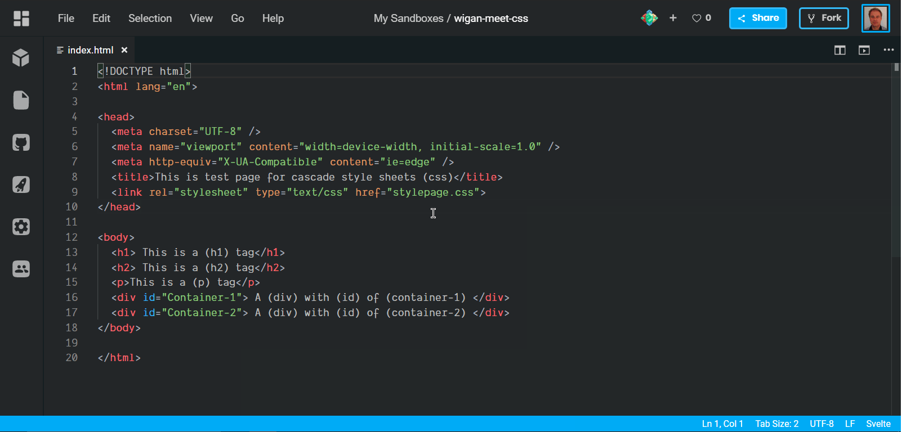
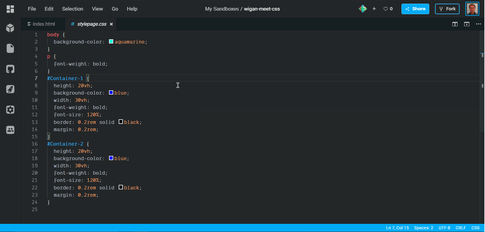
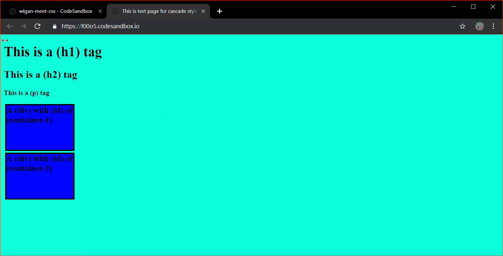

                                                      Cascade Style Sheet  CSS 

Lets jump right in and setup the html basic boilerplate we will use this for test purposes.

Make a file and name it <u>index.html</u>.

Just type what as been added into the (head) and (body) of index.html, using the screen shot below.The (head) (link)(href) <u>stylepage.css </u> is used link the separate css file, so we can use the code to alter the appearance of the <u>index.html page</u>.

Then add a new file and call it the same as the (link) (href) in the <u>index.html</u> file.
____
***Note all the linked files must be in the same directory as the index.html file if they are not the full path must be included in the (href).***
____
The html file is now linked to the css file, it is now ready to use.

Now type text of you choice to describe the html page between the (title) tags.

____

****The following CSS properties can be used to change the appearance of the html page.****

>* Positions
>* Heights
>* Widths
>* colors
>* fonts
>* text sizes
>* animations
>* borders

The list of properties is quite extensive to many to list here. **click the link to see more...**
<a href="https://htmlcheatsheet.com/css/" target="_blank">https://htmlcheatsheet.com/css/</a>

## Adding style to the html page
____
Now open the empty <u>stylepage.css</u> file that was linked to the <u> index.html</u> and type the following text. **Use the screen shot as the reference**.
____

_____

If the <u>html.index</u> page is now viewed in the browser all the body of the page will now be the background color assigned to the the body element. In this instance (aquamarine) was the assigned value.

____

____

Lets look at the first line and the element that's changed is the (body). Below is the syntax used in css;
___
~~~
body {
    background-color: aquamarine;
}
~~~

>1. (body) refers to the name of the html element and is called the selector.
>2. The opening ({) curly bracket signifies the start of the block of properties being used.
>3. {background-color) is the property we can use in css to change exactly just that, the color of the background.
>4. After that the double colon (:) to separate the property from the value.
>5. Next the value is set which is a color (aquamarine).
>6. Then a semi colon is used to show the end of the property and its value.
>7. A  closing (}) curly bracket signifies the end of the block of properties.
