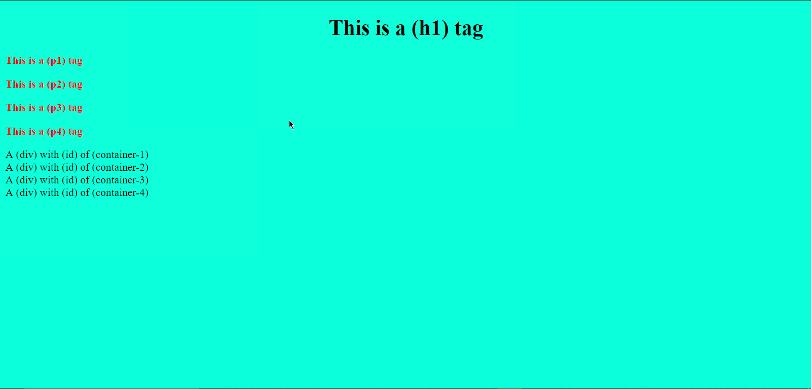

                                                      Cascade Style Sheet  CSS 

Lets jump right in and setup the html basic boilerplate we will use this for test purposes.

Make a file and name it <u>index.html</u>.

Just type what as been added into the (head) and (body) of index.html, using the screen shot below.The (head) (link)(href) <u>stylepage.css </u> is used link the separate css file, so we can use the code to alter the appearance of the <u>index.html page</u>.

Then add a new file and call it the same as the (link) (href) in the <u>index.html</u> file.
____
***Note all the linked files must be in the same directory as the index.html file if they are not the full path must be included in the (href).***
____
The html file is now linked to the css file, it is now ready to use.

Now type text of you choice to describe the html page between the (title) tags.

____

****The following CSS properties can be used to change the appearance of the html page.****

>* Positions
>* Heights
>* Widths
>* colors
>* fonts
>* text sizes
>* animations
>* borders

The list of properties is quite extensive to many to list here. **click the link to see more...**
<a href="https://htmlcheatsheet.com/css/" target="_blank">https://htmlcheatsheet.com/css/</a>

## Adding Style To A html Page
____
#### Now open the empty <u>stylepage.css</u> file that was linked to the <u> index.html</u> and type the following lines 1 to 3. 

#### **Use the screen shot as the reference.

_____

If the <u>html.index</u> page is now viewed in the browser all the body of the page will now be the (background-color) assigned to the the body element. In this instance (aquamarine) was the assigned value.

____

____

Lets look at the first line and the element that's changed is the (body). Below is the syntax used in css;
___
~~~
body {
    background-color: aquamarine;
}
~~~

>1. (body) refers to the name of the html element that will be changed, it is called the selector.
>2. The opening ({) curly bracket signifies the start of the block of properties being used.
>3. (background-color) is the property we can use in css to change exactly just that, the color of the background.
>4. After that the double colon (:) to separate the property from the value.
>5. Next the value is set which is a color (aquamarine).
>6. Then a semi colon is used to show the end of the property and its value.
>7. A  closing (}) curly bracket signifies the end of the block of properties.

##  Text Positioning
____
 There are many ways to re-position text on a page, one way is to use the align-text property and a value.
 >* center
 >* left
 >* right
 
___
 
 
 #### Type the lines 5 to 7 below they change the position of the (h1) tag to the center of the page.
 

____

 
___

 ### Text Appearance

 Text can be changed also in may different ways here are a few basic properties that can be used.
 
 >* font-size
 >* color
 >* font-weight
 >* text-shadow
 
 
 
 _____
 #### Type the lines 9 to 12 the (p) tag text will change color to red and font becomes bold.
 
 
 
 
 
 
 Click on link to see more...
 <a href="https://developer.mozilla.org/en-US/docs/Learn/CSS/Styling_text/Fundamentals" target="_blank">https://developer.mozilla.org/en-US/docs/Learn/CSS/Styling_text/Fundamentals</a>

_____

## Using Flexbox Arrange Page Content

The flexbox properties help to arrange page content and also give you a more responsive page in different sized browser windows. Lets take a basic look at what can be achieved with flex.

_____

The (p) tags are now being displayed in a row instead of being stacked in a column as before.
In the <u>index.html</u> the (p) tags have been enclosed in a (div) with the (id) name of "text-container" this will enable flex to orientate the content held in the container.

#### Type lines 14 to 17 This will invoke the changes to the "text-container" with all the (p) tags inside it and change the orientation as in the screen shot above.
___

___

## Making Basic Shapes And Altering There Position 
#### Type the following lines 19 to 57 from the screen shots.

  

Using (div) containers with an (id) name will again allow the orientation of the container to be changed.

Each container as been given properties to make box shapes they have..
>* height
>* background-color
>* width
>* border

The (height) and (width) set the container box size then when the property (background-color) is assigned a value the color inside the container changes from the (body) color value, which is (aquamarine) to the new color value.

***Note if the (background-color) value is not changed the default will be the same as the parent element which is the (body) (aquamarine) and the box's will not be visible on the page.***
___

____
## Flexbox Properties And Values

 #### Now type the last lines 59 to 62 this will change the container box's so they are now in a row on the page.
 
 

 The 4 container box's are enclosed in a main (div) named (box-container) flex can be used to arrange the box shapes as you wish, try by assigning a new value to the property (flex-direction).

Here is a few values that can be used..
>* row
>* row-reverse
>* column
>* column-reverse

Flexbox is very good at arranging content on the page and there are many more properties and values that can be used check them out at..
<a href="https://developer.mozilla.org/en-US/docs/Web/CSS/CSS_Flexible_Box_Layout/Basic_Concepts_of_Flexbox" target="_blank">https://developer.mozilla.org/en-US/docs/Web/CSS/CSS_Flexible_Box_Layout/Basic_Concepts_of_Flexbox</a>

_____________

Written for Wigan-meet-up

Release date 30/05/2019

Author M Entwisle